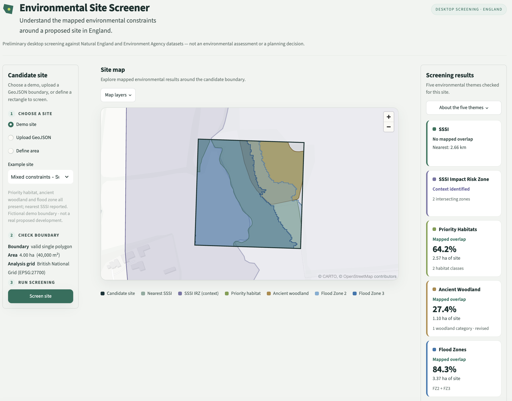
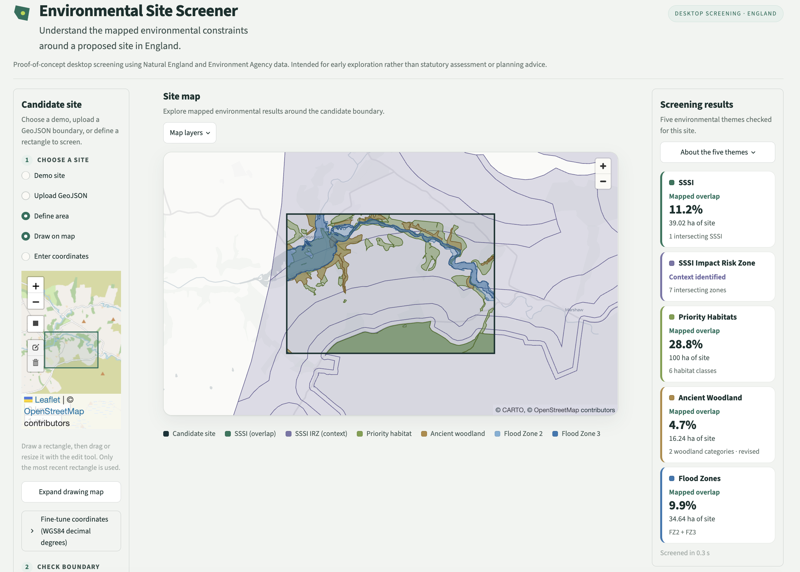
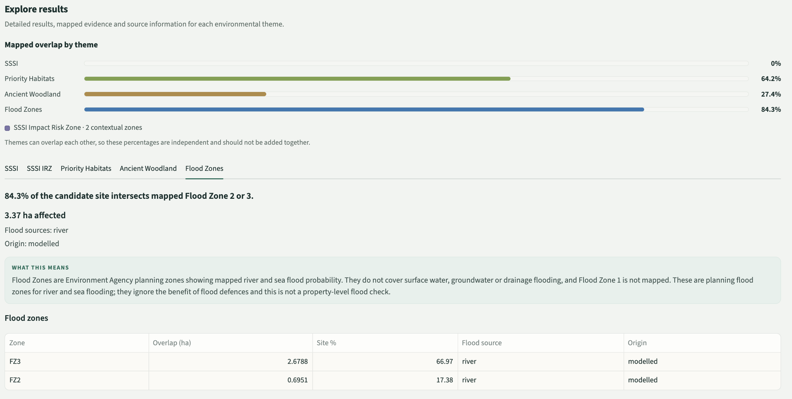

# Environmental Site Screener

Before taking a proposed development or infrastructure site further, an analyst usually has to make the same first set of GIS checks. Does the site overlap a protected site, priority habitat or ancient woodland? Is any of it within a mapped flood zone? Each check means working with a different national dataset, comparing it to the site, and recording what was found.

I built this Python application to bring those first checks into one repeatable workflow. You give it a candidate site boundary in England and it answers a single question:

> **What mapped environmental constraints or sensitivities should I know about before taking this site further?**

The app screens one candidate site at a time against five environmental themes and keeps the map, quantitative results and underlying source information together. It is a preliminary desktop screen rather than an environmental assessment, planning decision or Biodiversity Net Gain calculation.

Part of the motivation came from the growing role of biodiversity information in development and infrastructure work. [From 2 November 2026, Biodiversity Net Gain becomes mandatory for nationally significant infrastructure projects in England](https://www.gov.uk/guidance/biodiversity-net-gain-nationally-significant-infrastructure-projects). This tool does not calculate BNG, but that change reinforced my interest in how environmental spatial data can be used earlier in site investigation and how those initial checks can be made easier to repeat and explain.

This is a portfolio project. I wanted to build something close to the kind of GIS and environmental analysis work I would like to do professionally, using real national datasets and analytical decisions that I can explain and defend.

## Project walkthrough



*Video walkthrough to be added here. For now, this shows the screened Suffolk demonstration site.*

## What it does

You can give the app a candidate site in three ways:

- pick one of five built-in demonstration sites,
- upload a GeoJSON file containing a single `Polygon` or `MultiPolygon` feature,
- define a rectangle, either by drawing and resizing it on a map or by entering west, east, south and north coordinates.

The app then:

1. validates the geometry, including feature count, geometry type, CRS and positive area,
2. repairs an invalid user boundary with a visible warning where possible,
3. reprojects the site to British National Grid (`EPSG:27700`) if it arrived in another CRS, such as WGS84,
4. checks that the complete site falls inside England,
5. runs the five environmental checks when **Screen site** is pressed,
6. maps the results and presents the evidence separately for each environmental theme.

A drawn or typed rectangle goes through the same validation, England check and screening as an uploaded file.



## Environmental checks

| Theme | What the app checks | Main output |
| --- | --- | --- |
| **Sites of Special Scientific Interest** | Positive-area intersection between the site and SSSI polygons. Nearest SSSI edge distance when nothing overlaps. | Overlap area and percentage of the site, intersecting SSSI names, or the distance and name of the nearest SSSI. |
| **SSSI Impact Risk Zones** | Whether the site falls inside one or more mapped IRZ advice areas. | Count of intersecting zones and the Natural England advice link for each. No percentage or severity is assigned because an IRZ intersection is context rather than an adverse result. |
| **Priority Habitats** | Positive-area overlap with mapped priority habitat, classified by habitat code rather than source polygon count. | Affected area and percentage, plus the habitat classes involved. Non-priority context classes are reported separately and excluded from the headline figure. |
| **Ancient Woodland** | Overlap with the revised inventory where the project-derived revised-county coverage applies, and the legacy inventory elsewhere. | Affected area and percentage, plus woodland categories kept by inventory. See [docs/methodology.md](docs/methodology.md) for the precedence method. |
| **Flood Zones** | Overlap with Environment Agency Flood Zone 2 and Flood Zone 3 for rivers and sea. | Affected area and percentage per zone, plus flood source and data origin. |

Flood Zone 1 is not supplied as polygons in the source dataset, so the app does not manufacture a Flood Zone 1 layer. When there is no Flood Zone 2 or 3 overlap, it reports that specific result rather than saying the site has no flood risk.

The result view keeps the high-level percentages separate because the environmental themes can overlap the same piece of land. It also provides a detail tab for each theme with the mapped result, source attributes and guidance on how to interpret it.



## How the analysis works

- All area and distance calculations use `EPSG:27700`, a metre-based projected coordinate system. Areas and distances are not calculated directly in latitude/longitude.
- Intersections use the geometry itself and retain only positive-area results. A site that only touches a boundary line or corner does not count as overlapping it.
- Areas are calculated from the clipped geometry rather than trusting area values supplied in the source data.
- Where overlapping source polygons could count the same ground more than once, the clipped geometries are unioned before the headline area is calculated. Two polygons that each overlap 60% of a site therefore cannot produce a 120% affected result.
- Exactly one validated candidate site is analysed per run.
- The Flood Zones GeoPackage is roughly 5.9 GB, so the app reads only features within the candidate site's bounding box rather than loading the full national layer.
- The other reusable national datasets are loaded once and cached by the application.

For the dataset-specific calculations, assumptions and edge cases, see [docs/methodology.md](docs/methodology.md).

## A few decisions that mattered

**No overall score.** I keep the environmental themes separate rather than combining them into one suitability number. SSSI, habitats, woodland and flood zones mean different things, can overlap the same ground and do not have an obvious defensible weighting against one another. Showing the individual evidence is more useful than inventing a single score.

**IRZ stays contextual.** Being inside an SSSI Impact Risk Zone is not treated as an adverse environmental result. The zone is a prompt to check Natural England's advice for the type and scale of development. The app reports the spatial context and the available advice link rather than assigning severity.

**Ancient Woodland needs precedence rather than a simple merge.** The revised and legacy inventories overlap heavily where revised coverage exists, so simply unioning both datasets would duplicate information. Natural England does not provide a machine-readable completed-county coverage layer with the dataset, so this project uses a documented and dated allow-list of 29 ceremonial counties to decide where the revised inventory takes precedence and where the legacy data remains the fallback.

**Authoritative source geometry is not silently repaired.** If a user uploads an invalid boundary, the application may repair it with `shapely.make_valid()` and warns the user to inspect the result. Invalid geometry in an authoritative national dataset is instead reported and left unchanged. I wanted problems in source data to remain visible rather than quietly altering them.

## Data

The screening uses public national spatial datasets. The raw files are large and are not included in this repository.

| Theme | Publisher | Dataset |
| --- | --- | --- |
| SSSI | Natural England | Sites of Special Scientific Interest (England) |
| SSSI Impact Risk Zones | Natural England | SSSI Impact Risk Zones (England) |
| Priority Habitats | Natural England | Priority Habitats Inventory (England) |
| Ancient Woodland, revised | Natural England | Ancient Woodland Revised (England), Completed Counties |
| Ancient Woodland, legacy | Natural England | Ancient Woodland (England) |
| Flood Zones | Environment Agency | Flood Map for Planning, Flood Zones 2 and 3 |
| Revised Ancient Woodland coverage boundary | Ordnance Survey | Boundary-Line ceremonial counties |

These are open datasets published by Natural England, the Environment Agency and Ordnance Survey. Check each publisher's current licence terms before reusing the data.

[docs/data_sources.md](docs/data_sources.md) lists the exact source file expected by each loader and where it belongs under `data/raw/`.

[docs/data_audit.md](docs/data_audit.md) records the source inspection, fields used, revision information and known limitations.

The raw national datasets are deliberately excluded from Git. See [data/README.md](data/README.md) for the local directory layout.

## Demonstration sites

The five built-in sites are fictional screening boundaries rather than real development proposals. I chose them to exercise different parts of the application instead of showing five similar results.

- **Mixed constraints, Suffolk.** Priority habitat, ancient woodland and flood zone overlap, with the nearest SSSI reported because there is no direct SSSI overlap.
- **Urban mixed constraints, Cambridge.** Priority habitat and flood zone overlap near the edge of the city, with no Ancient Woodland overlap.
- **Multi-part site, Newbury.** One candidate site consisting of two separate parcels, demonstrating that a `MultiPolygon` is handled as a single site.
- **Low constraint, Lincolnshire Wolds.** An example where most themes return no mapped overlap.
- **Large-area screening, London.** A deliberately large area of roughly 22,600 ha, much larger than a normal development site. Every theme returns something and the denser map shows how the interface behaves across a broader extent.

## Testing

The current test suite contains **485 tests and passes in full**. The analytical tests use small synthetic geometries with known answers wherever possible rather than relying only on the national source files.

They cover, among other things:

- candidate-site validation, including `Polygon`, `MultiPolygon`, WGS84 reprojection, missing CRS, empty inputs, multiple features and non-polygon geometry,
- invalid user geometry and the repair-with-warning path,
- loader schema, required attributes and CRS behaviour,
- refusal to silently reproject or repair authoritative source data,
- complete, partial and zero overlap,
- boundary-only touches that should not count as overlap,
- disjoint and overlapping source geometries,
- cases where naive summation would double-count the same part of the site,
- nearest-feature distance and ties,
- England product-scope checks, including Wales, outside Great Britain and a boundary crossing the England border,
- GeoJSON upload failure cases,
- application state and map-layer visibility,
- the five demonstration result profiles,
- the mapped-overlap summary,
- real-data end-to-end screening scenarios.

Run the suite with:

```bash
python -m pytest -q
```

Most analytical tests do not require the national datasets. The real-data scenario script and a small number of application integration tests do.

## What this tool does not tell you

The aim is not to answer:

> **Can this site be developed?**

It is to help answer:

> **What mapped issues should someone look at more carefully?**

The application does not decide:

- whether planning permission will be granted,
- whether development is legally permitted,
- whether ecological harm will occur,
- whether a site passes or fails Biodiversity Net Gain,
- whether a site is environmentally good or bad,
- whether a site is safe to develop.

There are also limitations in the underlying data:

- mapped datasets can contain omissions and are revised over time,
- Flood Zones cover river and sea flooding rather than every possible flood mechanism,
- the Flood Zone mapping used here ignores the benefit of flood defences,
- an IRZ intersection is contextual and depends on the type and scale of proposed development,
- a desktop spatial screen is not a substitute for an ecological survey or other professional assessment.

There is no overall environmental score because the themes are not directly comparable and can overlap the same land. Keeping the evidence separate makes the reasoning easier to inspect.

## Running it locally

Clone the repository and install the Python dependencies:

```bash
git clone https://github.com/ariyoamy/environmental-site-screener.git
cd environmental-site-screener
python -m venv .venv
source .venv/bin/activate
pip install -r requirements.txt
```

To run the test suite:

```bash
python -m pytest -q
```

Most analytical tests work without any external data.

To run the full application, you also need the national source datasets. These are not stored in the repository and together total more than 10 GB.

Download the required files from their publishers and place them under `data/raw/` using the exact filenames listed in [docs/data_sources.md](docs/data_sources.md).

Then run:

```bash
streamlit run app.py
```

If source data is missing, the application reports which file it expected and where. [data/README.md](data/README.md) contains the expected directory layout.

## AI-assisted development

I deliberately made AI-assisted development part of this project because I wanted to become more proficient at using coding agents on a real technical problem, while also learning where they are useful and where they need to be constrained. I used **Claude Code in VS Code** throughout the project to explore implementations, draft and refactor code, debug problems, generate test cases and review changes.

The workflow mattered more to me than simply generating code quickly. I maintained clear project instructions and methodology notes, broke work into bounded tasks, asked the tool to inspect the existing implementation before changing it, reviewed diffs, ran tests and checked important spatial results against the source documentation and real data.

The project idea, dataset selection and analytical decisions remained my own. I decided how the datasets should be interpreted, investigated ambiguous cases, checked the assumptions behind proposed approaches and rejected changes when I could not justify them. That was particularly important for the Ancient Woodland precedence method, invalid authoritative geometries and the interpretation of SSSI Impact Risk Zones.

Working this way gave me experience of both the strengths and limitations of AI-assisted development. It was particularly useful for implementation, debugging, refactoring and expanding test coverage, but it still needed context, verification and domain judgement. My aim is to use tools such as Claude Code to make technical work more effective without outsourcing the critical thinking that makes the result defensible.

## Where I would take it next

The current version is a finished MVP focused on screening one candidate site well. If I were developing it further within an organisation, with access to its users, data and environmental expertise, I could see the same core workflow becoming a useful internal or client-facing site-screening application.

The next things I would investigate are:

- improving the interface through real user feedback and accessibility testing,
- adding climate-change flood information alongside the present-day Flood Zones,
- adding other environmental layers where they answer a clear screening question rather than simply increasing the layer count,
- moving the national source datasets into a hosted data architecture so users do not need local multi-gigabyte downloads,
- adding a concise exportable screening summary that retains the evidence, source and provenance behind each result,
- comparing multiple candidate sites side by side where site-selection work requires it.

A production version would also need decisions around source-data updates, hosting, access control, monitoring, performance and the organisation's own screening criteria. Those are deliberately outside this portfolio MVP, but the current analytical components are separated and tested so that they can be extended rather than replaced.

I would be interested in exploring that next stage with organisations working in environmental consultancy, infrastructure, planning, utilities, development or other areas where early spatial screening is useful.

## Licence

This repository is shared publicly as a portfolio project. **No open-source licence is currently provided.**

If you are interested in adapting the work, collaborating on something similar or discussing a potential professional use for it, please get in touch.

## Contact

If you would like to discuss the project, suggest an improvement or talk about related GIS and environmental work:

- **Website:** [ariyoamy.github.io](https://ariyoamy.github.io/)
- **Email:** [ariyoamy@gmail.com](mailto:ariyoamy@gmail.com)